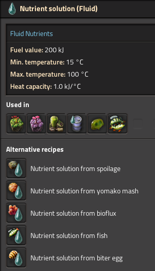
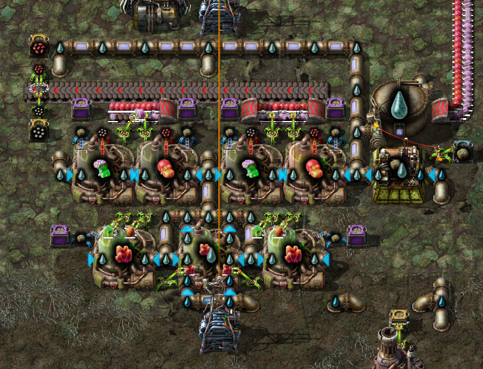
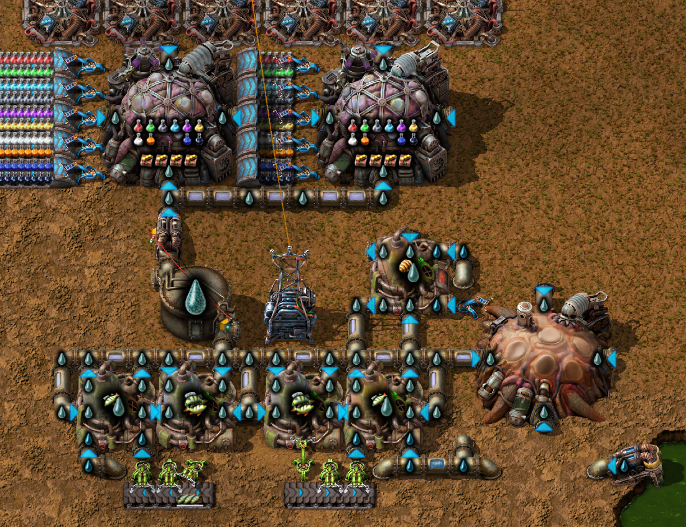

# fluid-nutrients
Mod for Factorio: Space Age

Make nutrients into a fluid instead of a spoilable solid.
Instead of dealing with spoiling nutrients now you have to weave pipes around biochambers.
Replaces existing recipes that use nutrients and biochambers are now fueled by nutrient solution.

Also comes with the following toggleable settings:
- Biolabs use nutrient solution as fuel (default=true)
- Captive biter spawners require nutrient solution as fuel (default=true)
- Fish breeding yields net positive nutrient solution (default=true)
- Nutrient solution flows through biochambers (default=false)
- Equal parts water needed to make nutrient solution (default=false)

