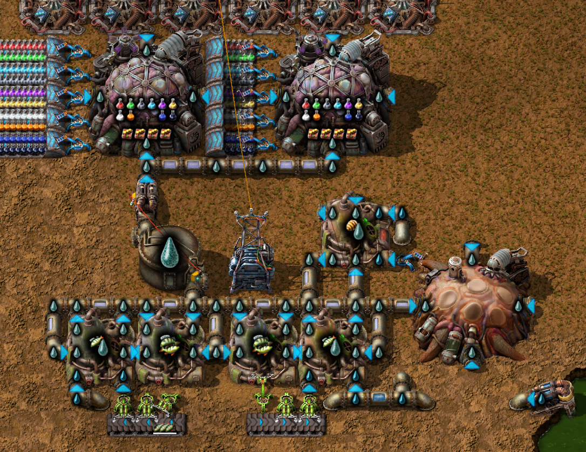

# fluid-nutrients
Factorio: Space Age mod to make nutrients into a fluid instead of a spoilable solid.

Replaces existing recipes that use nutrients and biochambers are now fueled by nutrient solution.

Also comes with the following toggleable settings:
- Biolabs use nutrient solution (default=true)
- Captive biter spawners use nutrient solution (default=true)
- Fish breeding net positive nutrient solution (default=true)
- Biochamber nutrient solution flow through (default=false)